## 1、题目查重

### 1.1 程序执行流程

1. 导入源库数据，将源库数据生成多键字典
2. 导入新库数据，将新库数据生成多键字典
3. 将两库数据合并生成新的总库字典
4. 将三库字典去除冗余字
5. 将三库字典的键和值进行交换，交换后新的键为题目，值为学号等信息
6. 将三库字典分别进行自我比较，得出的重复信息
7. 如果存在源库字典的重复数据，则生成重复(源库数据).csv，程序跳出
8. 如果存在新库字典的重复数据，则生成重复(新库数据).csv，程序跳出
9. 如果新源两个字典均无重复数据，则判断总库字典是否有重复。
10. 如总库字典存在重复数据，则生成重复(总库数据).csv，程序跳出
11. 如果三库数据均无重复，则生成汇总文件总库数据.csv，这个文件便是最终无重复的合并数据

### 1.2 测试：源库重，新库无重

> 执行日志

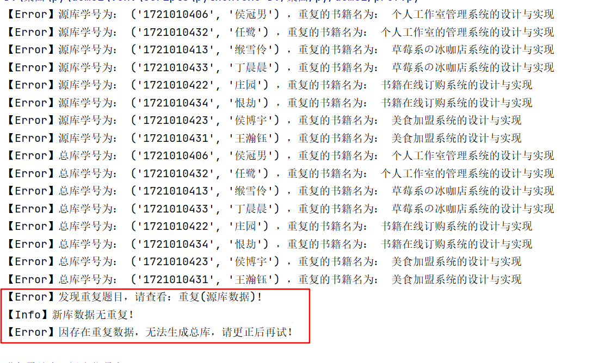

> 重复(源库数据)-0515121028

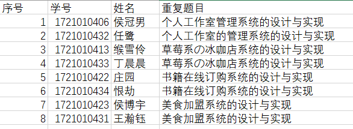

### 1.3 测试：源库无重，新库重

> 执行日志

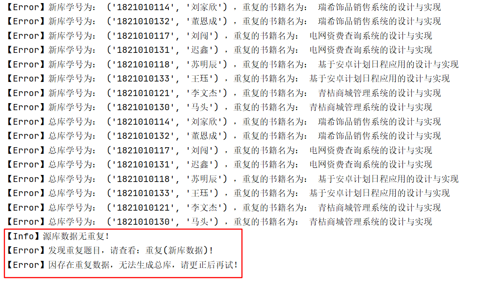

> 重复(新库数据)-0515121417

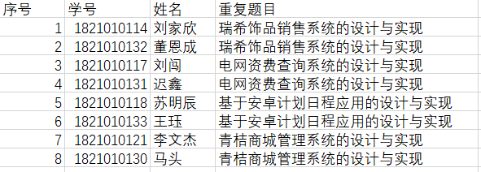

### 1.4 测试：源新均重复

> 执行日志

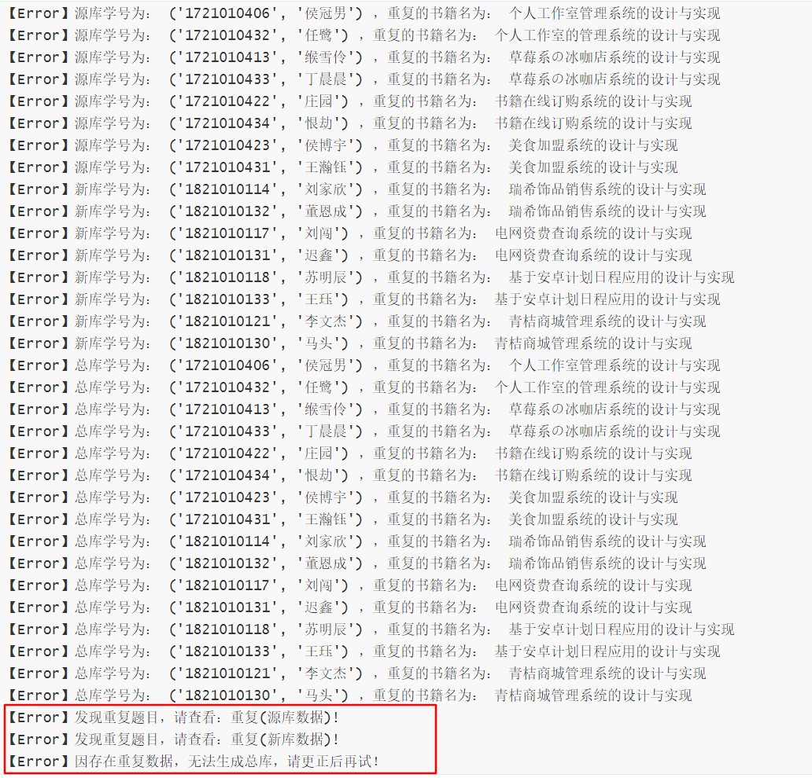

> 重复(新库数据)-0515121650

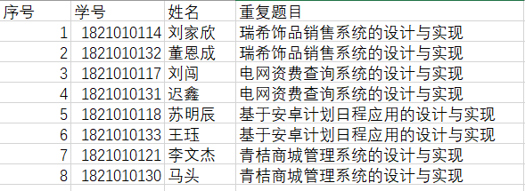

> 重复(源库数据)-0515121650

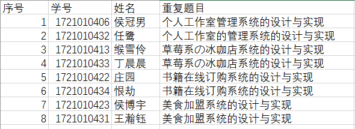

### 1.5 测试：本身无重，之间有重

> 执行日志

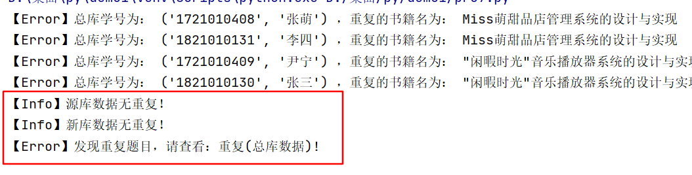

> 重复(总库数据)-0515122019

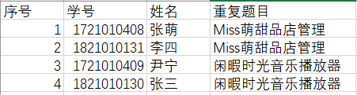

### 1.6 测试：三库均无重复

> 执行日志

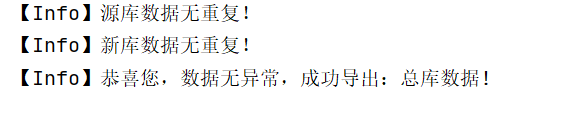

> 总库数据-0515122141

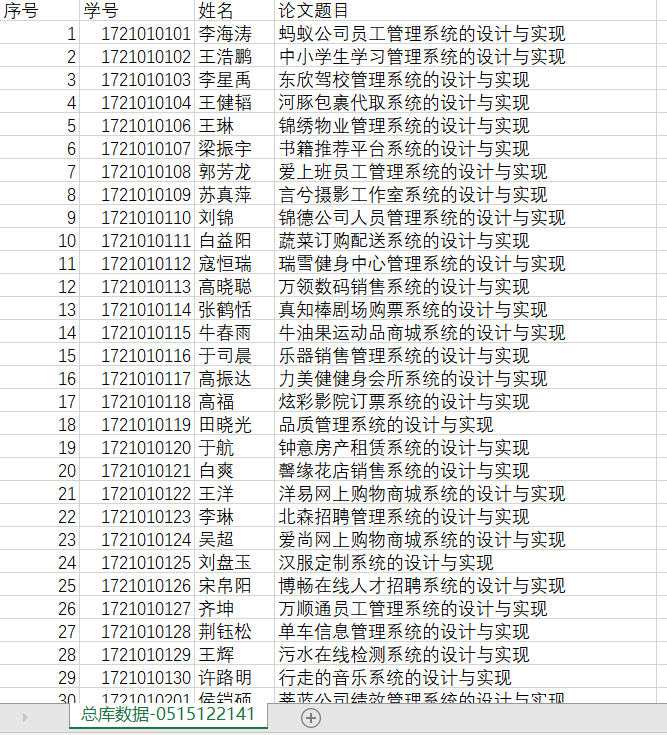

### 1.7 代码

```python
import csv          # 导入csv处理模块
import time         # 导入时间模块

titleRes = {}       # 用于存储源库原始数据
titleNew = {}       # 用于存储新库原始数据
titleSumCon = {}    # 用于存储两个库原始汇总数据

# 导入源库中数据
with open("D:/桌面/py/作业（4-28）/中文题目（原始数据无重复）.csv","r") as fpRes:
    readerRes = csv.reader(fpRes)
    next(readerRes)            # 指针往下移动1位，就是不处理表头
    for rows in readerRes:
        snoResTemp = rows[1]      # 取学号数据
        snameResTemp = rows[2]    # 取姓名数据
        titleResTemp = rows[3]    # 取题目数据
        # 解决数据合并时空行的问题
        if not bool(snoResTemp) and not bool(snameResTemp) and not bool(titleResTemp):
            continue
        titleRes[(snoResTemp,snameResTemp)] = titleResTemp  # 以多键对一值的方式存入字典

# 导入新库中数据
with open("D:/桌面/py/作业（4-28）/毕设题目（新库数据无重复）.csv","r",encoding='gb18030') as fpNew:
    readerNew = csv.reader(fpNew)
    next(readerNew)            # 指针往下移动1位，就是不处理表头
    for rows in readerNew:
        snoNewTemp = rows[4]        # 取学号数据
        snameNewTemp = rows[2]      # 取姓名数据
        titleNewTemp = rows[5]      # 取题目数据
        if not bool(snoNewTemp) and not bool(snameNewTemp) and not bool(titleNewTemp):
            continue
        titleNew[(snoNewTemp,snameNewTemp)] = titleNewTemp

# 导入两库的原始数据
titleSumCon.update(titleRes)
titleSumCon.update(titleNew)

# 去掉多余的字
titleMoRes = titleRes.copy()       # 用于存储旧库去冗余后的数据
titleMoNew = titleNew.copy()       # 用于存储新库去冗余后的数据
titleMoSum = {}                    # 用于存储两个库去冗余字后的汇总数据
for keyRes in titleMoRes:
    for i in "的地'相关''系统的设计与实现'":
        titleMoRes[keyRes] = titleMoRes[keyRes].replace(i,"")
for keyNew in titleMoNew:
    for i in "的地'相关''系统的设计与实现'":
        titleMoNew[keyNew] = titleMoNew[keyNew].replace(i,"")
titleMoSum.update(titleMoRes)      # 汇总旧库中去冗余的数据
titleMoSum.update(titleMoNew)      # 汇总新库中去冗余的数据

# 键值交换功能
queryRes = {}  # 存储交换后源库数据
queryNew = {}  # 存储交换后新库数据
querySum = {}  # 存储交换后汇总数据
for keyRes,valueRes in titleMoRes.items():   # 遍历字典中返回的键和值
        queryRes.setdefault(valueRes,[]).append(keyRes) # 设置query的键为titleMo的值，query的值为titleMo的键
for keyNew,valueNew in titleMoNew.items():   # 遍历字典中返回的键和值
        queryNew.setdefault(valueNew,[]).append(keyNew)
for keySum,valueSum in titleMoSum.items():   # 遍历字典中返回的键和值
        querySum.setdefault(valueSum,[]).append(keySum)

#提取重复的键值对
lsRes = {}  # 存取源库中的重复数据
lsNew = {}  # 存取新库中的重复数据
lsSum = {}  # 存取汇总后的重复数据
for keyRes in queryRes.keys():            # 遍历薪字典中的key（书名）
    if len(queryRes[keyRes]) > 1:         # 如果key的值（学号）有多个
        for i in queryRes[keyRes]:        # 遍历这些个值（学号）
            print("【Error】源库学号为：",i,"，重复的书籍名为：",titleRes[i]) # 打印问题学生的学号和题目
            lsRes[i] = titleRes[i]
for keyNew in queryNew.keys():  # 遍历薪字典中的key（书名）
    if len(queryNew[keyNew]) > 1:         # 如果key的值（学号）有多个
        for i in queryNew[keyNew]:        # 遍历这些个值（学号）
            print("【Error】新库学号为：",i,"，重复的书籍名为：",titleNew[i]) # 打印问题学生的学号和题目
            lsNew[i] = titleNew[i]
for keySum in querySum.keys():  # 遍历薪字典中的key（书名）
    if len(querySum[keySum]) > 1:         # 如果key的值（学号）有多个
        for i in querySum[keySum]:        # 遍历这些个值（学号）
            print("【Error】总库学号为：",i,"，重复的书籍名为：",titleSumCon[i]) # 打印问题学生的学号和题目
            lsSum[i] = titleMoSum[i]

# 将重复的源库数据写入对应的CSV
time = time.strftime("%m%d%H%M%S", time.localtime(time.time()))  # 获取当前系统时间，并把获取的时间转换成"年月日格式”
if not bool(lsRes):
    print("【Info】源库数据无重复！")
else:
    count = 0
    f = open("D:/桌面/py/作业（4-28）/重复(源库数据)-"+time+".csv", "w")
    f.write("序号,学号,姓名,重复题目\n")
    for row in lsRes.items():
        count = count + 1
        seqRow = (str(count),row[0][0],row[0][1],row[1])
        f.write(",".join(seqRow) + "\n")
    else:
        print("【Error】发现重复题目，请查看：重复(源库数据)!")
    f.close()

# 将重复的新库数据写入对应的CSV
if not bool(lsNew):
    print("【Info】新库数据无重复！")
else:
    count = 0;
    f = open("D:/桌面/py/作业（4-28）/重复(新库数据)-"+time+".csv", "w")
    f.write("序号,学号,姓名,重复题目\n")
    for row in lsNew.items():
        count = count + 1
        newRow = (str(count),row[0][0],row[0][1],row[1])
        f.write(",".join(newRow) + "\n")        # 将序列seqRow以逗号分隔输出，末尾换行
    else:
        print("【Error】发现重复题目，请查看：重复(新库数据)!")
    f.close()

# 判断汇总数据条件是否成立，成立生成汇总CSV，否则提示修改数据
if not bool(lsRes) and not bool(lsNew):
    count = 0
    if not bool(lsSum):
        f = open("D:/桌面/py/作业（4-28）/总库数据-" + time + ".csv", "w")
        f.write("序号,学号,姓名,论文题目\n")
        for row in titleSumCon.items():
            count = count + 1
            sumConRow = (str(count), row[0][0], row[0][1], row[1])
            f.write(",".join(sumConRow) + "\n")
        else:
            print("【Info】恭喜您，数据无异常，成功导出：总库数据!")
    else:
        f = open("D:/桌面/py/作业（4-28）/重复(总库数据)-"+time+".csv", "w")
        f.write("序号,学号,姓名,重复题目\n")
        for row in lsSum.items():
            count = count + 1
            sumRow = (str(count), row[0][0], row[0][1], row[1])
            f.write(",".join(sumRow) + "\n")
        else:
            print("【Error】发现重复题目，请查看：重复(总库数据)!")
else:
    print("【Error】因存在重复数据，无法生成总库，请更正后再试！")
```


## 2、外文查重

### 2.1 测试数据

#### 2.11 源库数据

> 待查重的各个学生的论文相关信息

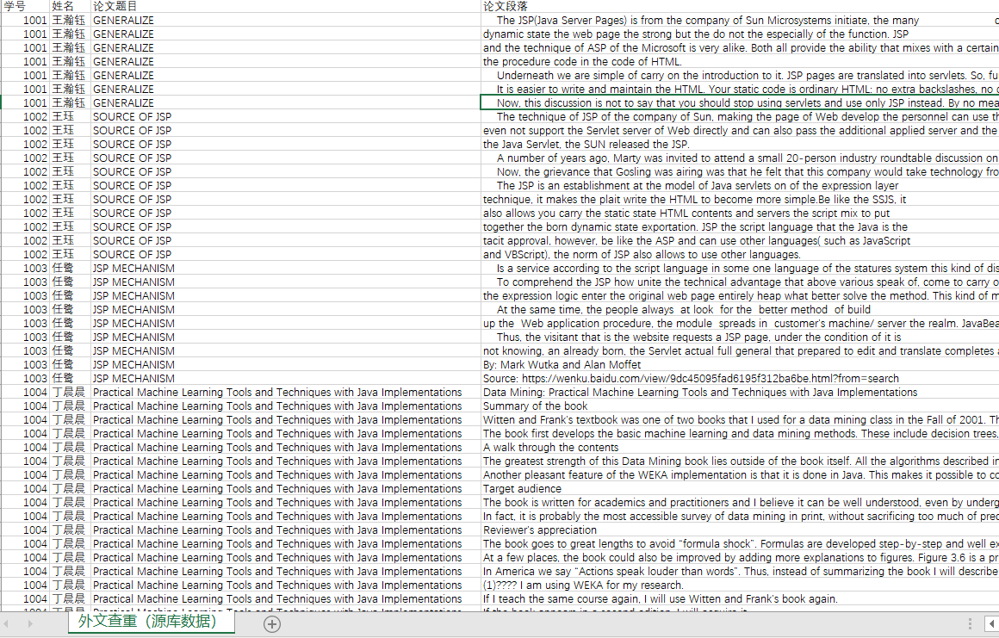

#### 2.12 总库数据 

> 存放了入库的各个学生的论文相关信息

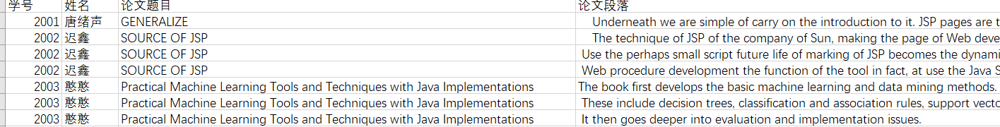

### 2.2 程序执行流程

1. 导入源库数据，将源库数据生成多键字典
2. 导入总库数据，将总库数据生成多键字典
3. 将源库数据和总库数据以==句节==为单位拆分成一个个的句子
4. 将源库的每一句话，分别放入总库中查找是否存在重复，将重复的信息单独保存
5. 计算并输出存在重复同学的重复率
6. 将重复的具体信息生成新的CSV

### 2.3 执行结果

> 重复率

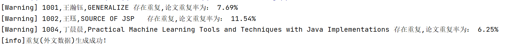

> CSV

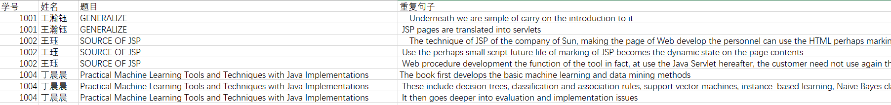

### 2.4 代码

```python
import csv
import time
# 导入新库中数据
titleEngRes = {}    # 存放源库数据
titleEngSum = {}    # 存放总库数据
queryEngSum = {}    # 存放合并后的总库段落
lsEngSum = {}       # 存放重复的论文信息
str1 = ""           # 将数据转换成字符串
queryResEngSum = {}    # 拆分成句子后的源库数据

# 提取源库数据
time = time.strftime("%m%d%H%M%S", time.localtime(time.time()))  # 获取当前系统时间，并把获取的时间转换成"年月日格式”
with open("D:/桌面/py/作业（4-28）/外文查重（源库数据）.csv","r") as fpEng:
    readerEng = csv.reader(fpEng)
    next(readerEng)
    for rows in readerEng:
        snoEngResTemp = rows[0]         # 提取学号
        snameEngResTemp = rows[1]       # 提取姓名
        snameEngTitleResTemp = rows[2]  # 提取论文题目
        resKeytemp = snoEngResTemp+","+snameEngResTemp+","+snameEngTitleResTemp # 将学号，姓名，题目拼接成串
        titleEngRes.setdefault(resKeytemp,[]).append(rows[3])   # 将同一个姓名下的所有段落整合成1篇文章
    for key in titleEngRes.keys():
        for i in titleEngRes[key]:
            str1 = str1 + str(i)    # 将同一键下的所有内容（一个个字符串）拼接成一个大字符串
        queryResEngSum[key] = str1.split(".").copy()   # 将文章拆分成以句子为单位的1个个列表赋予新的字典
        queryResEngSum[key].pop()                      # 去掉首尾多余的空格
        str1 = ""
#print(lsResEngSum) # 测试：lsResEngSum存放了各个键下面对应的各个句子的字符串

# 提取总库数据
str1 = ""
with open("D:/桌面/py/作业（4-28）/外文查重（总库数据）.csv","r") as fpEng:
    readerEng = csv.reader(fpEng)
    next(readerEng)
    for rows in readerEng:
        snoEngSumTemp = rows[0] # 提取总库学号作为键
        titleEngSum.setdefault(snoEngSumTemp, []).append(rows[3])
        # print(titleEngRes.keys(),"\n")
    for key in titleEngSum.keys():
        for i in titleEngSum[key]:
            str1 = str1 + str(i)  # 将同一键下的所有内容（一个个字符串）拼接成一个大字符串
        queryEngSum[key] = str1.split(".").copy() # 将同一个学号下的所有段落整合成1篇文章
        queryEngSum[key].pop() # 去除首位空格
        str1 = ""
#print(lsEngSum)  # 测试：lsEngSum字典中存放了每个学号下的，各个句子的字符串

# 内容查重
for resKey in queryResEngSum.keys():       # 遍历源库字典的各个键
    for res in queryResEngSum[resKey]:     # 遍历源库中各个键对应的所有句子
        #print("[源库数据]",res,"\n\n\n") # 测试：查询源库输出的各个语句
        for sumKey in queryEngSum.keys():
            for sum in queryEngSum[sumKey]:
                #print("[总库数据]",sum,"\n\n\n") # 测试：查询源库输出的1个语句后，总库输出的所有语句（源库中的每个语句都需要跟总库的所有语句比对）
                if res == sum:
                    lsEngSum.setdefault(resKey,[]).append(res)  # 将重复的数据存入lsEngSum

# 计算重复率
for resKey in queryResEngSum.keys():       # 遍历源库所有键
    for lsEngKey in lsEngSum.keys():    # 遍历重复库中的所有键
        if resKey in lsEngKey:
            resLen = len(queryResEngSum[resKey])   # 存在重复的论文全部句子个数
            lsLen = len(lsEngSum[lsEngKey])     # 存在重复的论文重复句子个数
            print("[Warning]",resKey,"存在重复,论文重复率为：",'{:.2%}'.format(lsLen / resLen))

# 生成详细重复内容的csv
with open("D:/桌面/py/作业（4-28）/重复(外文数据)-"+time+".csv", "w",newline="") as csvfile:
    writer = csv.writer(csvfile)
    writer.writerow(["学号","姓名","题目","重复句子"])
    for rowKey in lsEngSum.keys():
        rowKeyList = str(rowKey).split(",").copy()
        for rowValue in lsEngSum[rowKey]:
            new = [rowKeyList[0],rowKeyList[1],rowKeyList[2],rowValue]
            writer.writerow(new)
    else:
        print("[Warning]重复(外文数据)生成成功！ ")

```

## 3、中文查重

### 3.1 测试数据

#### 3.11 源库数据

> 待查重的各个学生的论文相关信息

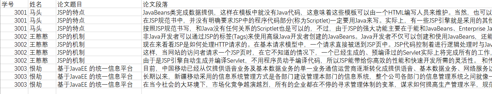

#### 3.12 总库数据

> 存放了入库的各个学生的论文相关信息

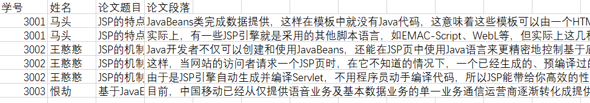

### 3.2 程序执行流程

1. 导入源库数据，将源库数据生成多键字典
2. 导入总库数据，将总库数据生成多键字典
3. 将源库数据和总库数据以==句节==为单位拆分成一个个的句子
4. 将源库的每一句话，分别放入总库中查找是否存在重复，将重复的信息单独保存
5. 计算并输出存在重复同学的重复率
6. 将重复的具体信息生成新的CSV

### 3.3 执行结果

> 重复率

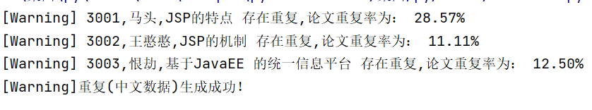

> CSV

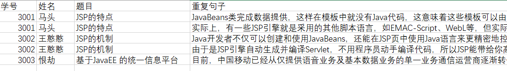

### 3.4 代码

```python
import csv
import time
# 导入新库中数据
titleZhRes = {}    # 存放源库数据
titleZhSum = {}    # 存放总库数据
queryZhSum = {}    # 存放合并后的总库段落
lsZhSum = {}       # 存放重复的论文信息
str1 = ""           # 将数据转换成字符串
queryResZhSum = {}    # 拆分成句子后的源库数据

# 提取源库数据
time = time.strftime("%m%d%H%M%S", time.localtime(time.time()))  # 获取当前系统时间，并把获取的时间转换成"年月日格式”
with open("D:/桌面/py/作业（4-28）/中文查重（源库数据）.csv","r") as fpEng:
    readerEng = csv.reader(fpEng)
    next(readerEng)
    for rows in readerEng:
        snoEngResTemp = rows[0]         # 提取学号
        snameEngResTemp = rows[1]       # 提取姓名
        snameEngTitleResTemp = rows[2]  # 提取论文题目
        resKeytemp = snoEngResTemp+","+snameEngResTemp+","+snameEngTitleResTemp # 将学号，姓名，题目拼接成串
        titleZhRes.setdefault(resKeytemp,[]).append(rows[3])   # 将同一个姓名下的所有段落整合成1篇文章
    for key in titleZhRes.keys():
        for i in titleZhRes[key]:
            str1 = str1 + str(i)    # 将同一键下的所有内容（一个个字符串）拼接成一个大字符串
        queryResZhSum[key] = str1.split("。").copy()   # 将文章拆分成以句子为单位的1个个列表赋予新的字典
        queryResZhSum[key].pop()                      # 去掉首尾多余的空格
        str1 = ""
#print(queryResZhSum) # 测试：lsResEngSum存放了各个键下面对应的各个句子的字符串

# 提取总库数据
str1 = ""
with open("D:/桌面/py/作业（4-28）/中文查重（总库数据）.csv","r") as fpEng:
    readerEng = csv.reader(fpEng)
    next(readerEng)
    for rows in readerEng:
        snoEngSumTemp = rows[0] # 提取总库学号作为键
        titleZhSum.setdefault(snoEngSumTemp, []).append(rows[3])
        # print(titleEngRes.keys(),"\n")
    for key in titleZhSum.keys():
        for i in titleZhSum[key]:
            str1 = str1 + str(i)  # 将同一键下的所有内容（一个个字符串）拼接成一个大字符串
        queryZhSum[key] = str1.split("。").copy() # 将同一个学号下的所有段落整合成1篇文章
        queryZhSum[key].pop() # 去除首位空格
        str1 = ""
#print(queryZhSum)  # 测试：lsEngSum字典中存放了每个学号下的，各个句子的字符串

# 内容查重
for resKey in queryResZhSum.keys():       # 遍历源库字典的各个键
    for res in queryResZhSum[resKey]:     # 遍历源库中各个键对应的所有句子
        #print("[源库数据]",res,"\n\n\n") # 测试：查询源库输出的各个语句
        for sumKey in queryZhSum.keys():
            for sum in queryZhSum[sumKey]:
                #print("[总库数据]",sum,"\n\n\n") # 测试：查询源库输出的1个语句后，总库输出的所有语句（源库中的每个语句都需要跟总库的所有语句比对）
                if res == sum:
                    lsZhSum.setdefault(resKey,[]).append(res)  # 将重复的数据存入lsEngSum

# 计算重复率
for resKey in queryResZhSum.keys():       # 遍历源库所有键
    for lsEngKey in lsZhSum.keys():    # 遍历重复库中的所有键
        if resKey in lsEngKey:
            resLen = len(queryResZhSum[resKey])   # 存在重复的论文全部句子个数
            lsLen = len(lsZhSum[lsEngKey])     # 存在重复的论文重复句子个数
            print("[Warning]",resKey,"存在重复,论文重复率为：",'{:.2%}'.format(lsLen / resLen))

# 生成详细重复内容的csv
with open("D:/桌面/py/作业（4-28）/重复(中文数据)-"+time+".csv", "w",newline="") as csvfile:
    writer = csv.writer(csvfile)
    writer.writerow(["学号","姓名","题目","重复句子"])
    for rowKey in lsZhSum.keys():
        rowKeyList = str(rowKey).split(",").copy()
        for rowValue in lsZhSum[rowKey]:
            new = [rowKeyList[0],rowKeyList[1],rowKeyList[2],rowValue]
            writer.writerow(new)
    else:
        print("[Warning]重复(中文数据)生成成功！ ")

```


